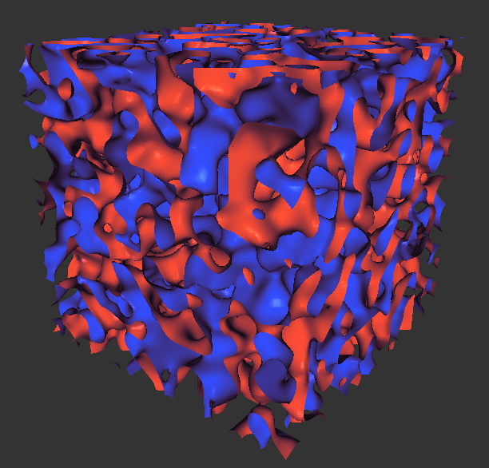

# Marching Cubes implementation benchmark

 Project made for "Parallel Processing" course at Politechnika Poznańska

Project focuses on comapring 3 different implementations of [Marching Cubes](https://en.wikipedia.org/wiki/Marching_cubes) algrithm

 1. Doing computations on 1 CPU thread
 2. Using all avaliable CPU threads with [OpenMP](https://www.openmp.org)
 3. Using [CUDA](https://pl.wikipedia.org/wiki/CUDA)

Project has 3 executable targets:
 - [marching](#marching) - for headless computation with option to save model to .obj

 - [marching_vis](#marching_vis) - for displaying generated model with OpenGL

 - time_test - used by launch_tests.py script for benchmarking

## marching

Generate mesh, display computation time and number of generated triangles and save result to file

options include:
 - using gradient smoothing
 - skipping saving to file
 - generating shapes instead of loading from files (avalible shapes: `sphere` `torus` and `perlin`)
 - choosing implementation

use `-h` `--help` for list of all avaliable options

## marching_vis

Generate mesh and display it using OpenGL

options include:
 - using gradient smoothing
 - generating shapes instead of loading from files (avalible shapes: `sphere` `torus` and `perlin`)
 - animating generation
 - choosing implementation

 use `-h` `--help` for list of all avaliable options

Example output of running `./marching_vis -g perlin -d 10,100 -s`



## time_test

in order to run benchmark script - launch_test.py

you will need:
 - `numpy`
 - `tqdm`
 - built `time_test` executable

run with `python launch_tests.py [OPTIONS]`

use `--help` for list of options

## building with Cmake

required dependencies:
 - `cuda-nvidia-toolkit`
 - `thrust` - included in cuda-toolkit
 - `OpenMP` support
 - `glm`
 - `glfw3` - marching_vis only
 - `OpenGL` support using `GLEW` - marching_vis only

to build all targets, in project directory run:  
```sh
cmake ..
make
```

## credits

Algorithm based on https://paulbourke.net/geometry/polygonise/